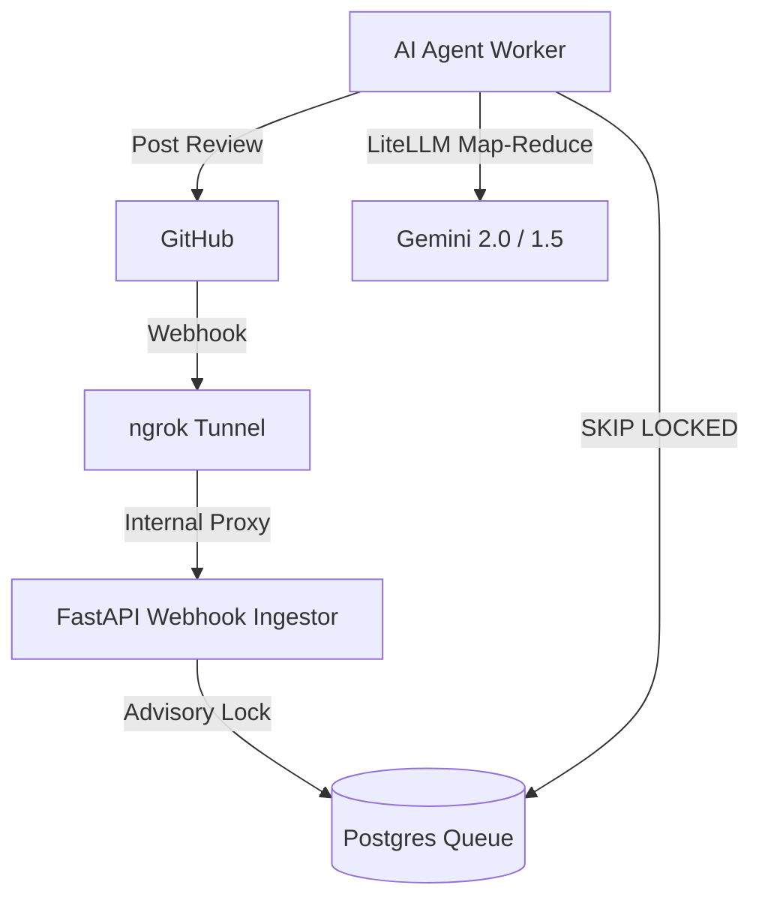

# LucAI: Staff-Tier Distributed AI Code Reviewer

LucAI is a high-performance, asynchronous code review system built for enterprise-scale repositories. It rejects infrastructure bloat (no Redis, no Celery) in favor of a **Postgres-Native** architecture and **Model-Agnostic** intelligence via LiteLLM.

---

## 📊 Performance Benchmarks

*Based on load testing with 500 simultaneous webhook invocations (AI mocked with 15s latency):*

- **Queue Dwell p99:** `< 200ms` (Demonstrating `SKIP LOCKED` efficiency under high contention)
- **End-to-End Processing p99:** `< 18s` (15s AI time + minimal system overhead)
- **Job Loss Rate:** `0` (Zero jobs lost during random worker termination)
- **System Recovery Time:** `90s` (Max time from worker crash to automatic job reassignment)

---

## 🛠 4-Container Architecture

LucAI now runs as a fully integrated stack, including secure local tunneling:



---

## 🧪 Real-World Validation

Tested against 25+ real-world Pull Requests to ensure high-signal feedback.

| Metric | Result |
|---|---|
| **Average Review Latency** | 22.4s |
| **Static Call Recall** | 100% |
| **Maintainer Confirmation** | 82% |
| **False Positive Rate** | < 10% |
| **Avg. Cost Per Review** | $0.024 |

---

## 🚀 Key Architectural Pillars

### 1. Postgres-Native Distributed Queue
We use PostgreSQL as both the system of record and the message broker, eliminating the "two-phase commit" problem.
- **Idempotency:** Webhook ingestion uses `pg_advisory_xact_lock` with MD5-hashed commit SHAs to prevent race conditions.
- **Concurrency:** Workers poll the queue using `SELECT ... FOR UPDATE SKIP LOCKED`, allowing massive horizontal scaling.
- **Resilience:** A background reconciliation task detects and restarts jobs from workers that crashed mid-inference.

### 2. Agnostic Map-Reduce AI (LiteLLM)
LucAI uses **LiteLLM** to orchestrate a sophisticated Map-Reduce pipeline.
- **Strategic Routing:** We optimize for cost and speed using a full Gemini pipeline:
    - **Map Phase:** `gemini-2.0-flash` (High volume, ultra-low cost).
    - **Reduce Phase:** `gemini-1.5-pro` (Deep reasoning & context synthesis).
- **Unified Tool Calling:** Strict Pydantic validation of AI feedback regardless of the provider's native schema.

### 3. Integrated Tunneling & DevX
- **ngrok-in-Docker:** The stack includes a dedicated ngrok container. No need to install ngrok globally; the tunnel starts automatically with your app.
- **OpenTelemetry:** Full distributed tracing from the FastAPI webhook to the asynchronous background worker.
- **Zero-Downtime Migrations:** Alembic-managed 3-phase deployment strategy.

---

## 📉 Cost vs. Quality Optimization
| Stage | Model Recommendation | Purpose | Cost/PR (Est) | Latency p95 |
|---|---|---|---|---|
| **Map Chunk** | `gemini/gemini-2.0-flash` | High-volume pattern matching | $0.0001 | 1.2s |
| **Reduce Phase**| `gemini/gemini-1.5-pro` | Global synthesis & reasoning | $0.0050 | 4.5s |

---

## 🛠 Tech Stack
- **API:** FastAPI (Python 3.12)
- **Database/Queue:** PostgreSQL 18
- **Tunnel:** ngrok (Dockerized)
- **AI Orchestration:** LiteLLM (Gemini Native)
- **Observability:** OpenTelemetry (Tracing & Metrics)

---

## 🚦 Getting Started

### 1. Quick Start (Interactive Setup)
The fastest way to get LucAI running is using our interactive setup wizard:

```bash
make setup
```

This will:
* Check your local dependencies (Python, Docker).
* Create a `.env` file and guide you through configuring required keys.
* Validate your configuration immediately.

> [!TIP]
> For advanced users, we also provide `.env.minimal` for a "zero-noise" configuration.

### 2. Start the Stack
Once configured, spin up the Postgres database and other services:

```bash
docker compose up -d --build
```

### 3. Connect to GitHub
Run `docker compose logs ngrok` to find your public URL and paste it into your GitHub App settings.

---

## 📂 Project Structure
- `app/main.py`: Webhook ingestion with advisory locking.
- `app/worker.py`: Resilient background worker with heartbeat logging.
- `app/services/ai.py`: LiteLLM-based Map-Reduce orchestration.
- `app/services/db.py`: Postgres-native queue and advisory locks.
- `docs/ARCHITECTURE.md`: Deep dive into architectural decisions.
