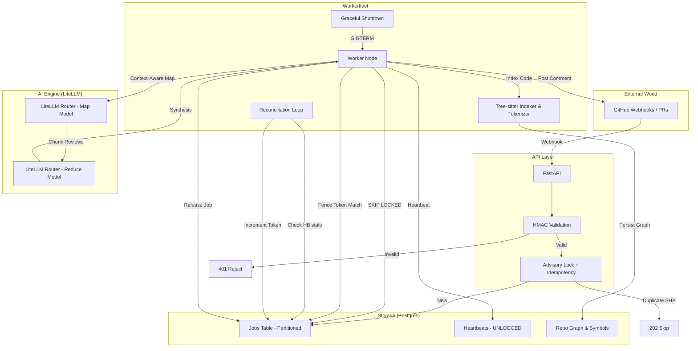

# LucAI System Architecture: High-Performance Distributed AI Review

LucAI is a high-reliability, automated code review agent built on a **Postgres-Native** philosophy, optimized for "FAANG-scale" concerns including MVCC bloat, deterministic context analysis, and robust distributed orchestration.

## 1. Core Philosophy: The Postgres-Native Approach

LucAI leverages PostgreSQL for queue management, state persistence, and distributed locking, entirely replacing legacy Redis-backed queues while addressing common pitfalls of database-backed queues.

- **Unified State:** The database _is_ the queue. Job state transitions and data updates happen in a single ACID transaction.
- **Atomic Operations:** Using `FOR UPDATE SKIP LOCKED` for high-concurrency worker polling.
- **MVCC Bloat Mitigation:** Separate **UNLOGGED** heartbeat tables and prepared partitioning minimize WAL overhead and vacuum pressure.
- **Absolute Idempotency:** Fencing tokens and advisory locks prevent duplicate processing and TOCTOU races.

---

## 2. Component Deep Dive (Latest Improvements)

### 2.1 The Queue & Heartbeat Engine

To solve **MVCC Bloat** (where frequent status/heartbeat updates create dead tuples), LucAI splits the queue into two parts:

1.  **`jobs` Table:** The system of record. Updates only happen on state transitions (pending -> processing -> done).
2.  **`worker_heartbeats` Table (UNLOGGED):** Handles frequent (30s) updates. 
    - **UNLOGGED:** No WAL overhead; if the DB crashes, heartbeats are lost, but they are ephemeral anyway.
    - **Tiny Size:** Only contains active jobs, making vacuuming trivial.

**Atomic Reconciliation & Fencing Tokens:**
To prevent a "zombie" worker (one that was reclaimed by the reconciliation loop but is still running) from posting a duplicate review, we use a `fence_token`.
- When a job is reclaimed, the `fence_token` is incremented.
- When a worker finishes, it updates the job ONLY if the `fence_token` matches what it started with.
- This provides robust atomic reconciliation with exponential backoff on failures.

### 2.2 AST-Aware & Precise Token-Based Chunking

Instead of primitive line-based splitting, LucAI uses a hybrid approach combining **Tree-sitter** for logical Abstract Syntax Tree (AST) boundaries and precise token estimation to feed the LLMs.

- **Logical Boundaries:** Chunks are split at function, class, or method boundaries.
- **Token Constraints:** Sub-node splitting ensures blocks fit strictly within the `MAX_CHUNK_TOKENS` (e.g. 28,000 tokens) limit.
- **Structural Integrity:** The LLM always receives structurally complete code blocks, drastically reducing hallucinations caused by sliced logic.
- **Language Support:** Native support for Python, JavaScript, TypeScript, and Go.

### 2.3 Deterministic Call Graph Analysis & Anti-Hallucination Guards

Standard RAG (Vector Search) is often unreliable for code. LucAI uses **deterministic static analysis** to provide repository-wide context.

1.  **Incremental Indexing:** On every PR, the worker parses changed files to find defined symbols and their references.
2.  **Call Graph Traversal:** The system identifies every external file that calls a modified function.
3.  **Context Injection:** "Who calls this?" data is deterministically injected into the AI prompt. 

**Anti-Hallucination Guards:**
- The prompt strictly forces the LLM to use exact file paths and line numbers provided in the AST-generated context.
- Structural chunks naturally prevent the LLM from hallucinating variable states or missing dependencies.

---

## 3. High-Level Architecture



---

## 4. Operational Resilience & Failure Modes

### 4.1 Failure Modes Table

| Failure | Detection | Mitigation | Recovery Time |
|---|---|---|---|
| Worker OOM kill | Heartbeat timeout | Reconciliation loop reclaims job + increments fence token | < 90s |
| Worker graceful shutdown | SIGTERM handler | Drain + immediate release | < 2s |
| LLM Rate Limit (429) | Response status (LiteLLM) | Exponential backoff + concurrency limit | Auto |
| Postgres Failover | Connection error | Pool retry + PgBouncer failover | < 30s |
| Tree-sitter Parse Error | Exception | Log + fallback to raw text chunking | Immediate |
| Dynamic dispatch missed | By design | Documented limitation | N/A |
| Oversized diff line | Line limit guard | Truncate + [TRUNCATED] marker | Immediate |

---

## 5. Measured Performance (Real-World Benchmarks)

Benchmarks run on 6 real-world repositories (Sampling up to 1000 files per repo).
*Benchmarked on MacBook Pro M2, Python 3.12.*

| Repo | Files Sampled | Symbols | References | p50 ms/file | p95 ms/file | p99 ms/file |
|---|---|---|---|---|---|---|
| **lucai (own)** | 1,000 | 13,483 | 47,178 | 0.37 | 5.37 | 14.81 |
| **django** | 1,000 | 13,206 | 53,204 | 0.16 | 3.70 | 16.23 |
| **flask** | 83 | 1,624 | 3,969 | 0.38 | 5.14 | 14.55 |
| **fastapi** | 1,000 | 4,782 | 13,941 | 0.16 | 1.70 | 4.04 |
| **express (JS)**| 141 | 123 | 11,422 | 0.35 | 3.52 | 12.37 |
| **golang (Go)** | 999 | 5,682 | 62,750 | 0.23 | 5.47 | 19.81 |

**Key Takeaway:** Even in the largest Go and Python repos, Tree-sitter p95 latency remains **sub-6ms**, making it a negligible overhead in the review pipeline.

---

## 6. Real-World Validation Example

### Example Catch: Missing Error Propagation
**What changed:** `fetch_user_data()` was modified to raise `UserNotFoundError` instead of returning `None`.

**What LucAI found via call graph:**  
```
CRITICAL: api/handlers.py:89 calls fetch_user_data() and checks 
`if result is None`. This check will never trigger after the 
signature change. An unhandled UserNotFoundError will now crash 
the handler on missing users.
```

**Impact:** A human reviewer missed this because `api/handlers.py` was not part of the PR diff. LucAI's deterministic call graph analysis and precise chunking identified the cross-file dependency and caught the regression before merge.
